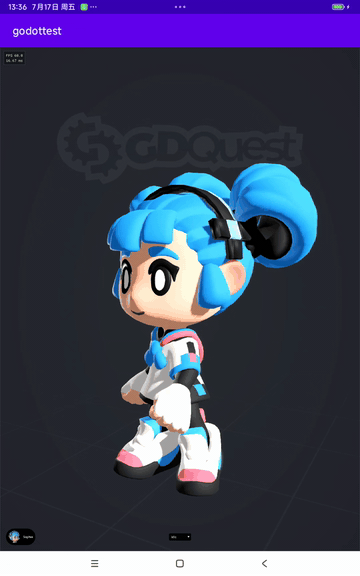

# Godot Embedded Library

这个仓库是我基于 Godot Engine 做的一套“可嵌入式 Godot 运行库”实验工程：目标不是做一个普通 Godot 编辑器分支，而是把 Godot Runtime 做成可以被外部宿主程序集成的库，让现有 Linux/Android 应用也能加载、渲染和驱动 Godot 项目。

核心思路是：宿主程序负责窗口、EGL/OpenGL 上下文、系统输入和生命周期，Godot 作为渲染与交互引擎被嵌入进去运行。

## Demo

<p align="center">
  
</p>

## 我做了什么

- 新增 `platform/embedded`，让 Godot 可以作为宿主无关的嵌入式平台运行。
- 增加 C ABI，用于外部程序初始化 Godot、驱动帧循环、同步窗口尺寸、关闭运行时。
- 打通外部输入到 Godot 输入管线，包括鼠标移动、点击、拖动、滚轮、键盘、文本输入。
- 实现 Linux GLFW 测试宿主，可以在普通桌面窗口里运行 Godot 项目，并保留 ImGui 调试 UI。
- 实现 Android 测试宿主，可以让用户选择手机存储里的 Godot 项目目录，然后直接传给 native 层运行。
- 修复嵌入式窗口 resize，让 Godot 画面跟随宿主窗口或 Surface 尺寸变化。
- 为测试项目增加键鼠/触摸反馈，便于验证 Godot UI 控件、输入 action 和文本控件是否正常。
- Android demo 增加 ImGui FPS overlay，用于观察运行时帧率。

## 为什么有价值

传统 Godot 用法通常是“Godot 控制整个应用”。这个工程尝试反过来：让已有应用控制外壳，把 Godot 当作一个可嵌入的实时 2D/3D 内容引擎使用。

它适合这些场景：

- 已有 Android/Linux 原生应用，希望嵌入 Godot 3D/2D 交互内容。
- 车机、座舱、HMI、展厅大屏、工业控制屏等需要宿主程序统一管理窗口和生命周期。
- 业务主程序不想完全迁移到 Godot，但希望使用 Godot 的渲染、动画、UI、脚本和资源管线。
- 需要把 Godot 项目作为可替换内容包，由外部应用选择路径并加载运行。
- 需要用 C/C++/Java/Kotlin/其他宿主代码驱动 Godot，而不是让 Godot 独占应用入口。

## 当前优势

- **宿主可控**：窗口、Surface、EGL 上下文、输入、生命周期都由外部宿主管理。
- **平台拆分清晰**：`platform/embedded` 保持宿主无关，Linux/Android demo 只负责各自系统事件转换。
- **输入链路完整**：鼠标、滚轮、键盘、文本输入、Android 触摸都能进入 Godot UI 和 `_input`。
- **尺寸同步可用**：宿主窗口或 Android Surface 改变后，Godot viewport 会同步更新。
- **验证工程齐全**：包含 Linux GLFW demo、Android demo、2D 输入反馈项目和 3D 角色项目。
- **适合集成验证**：可以快速判断一个现有 App 是否适合嵌入 Godot Runtime。

## 目录说明

- `platform/embedded/`：新增的嵌入式 Godot platform。
- `platform/android/hook/`：Android demo 使用的 Godot hook 层。
- `libTest/linux/`：Linux GLFW + ImGui 测试宿主。
- `libTest/android/`：Android GLSurfaceView + JNI 测试宿主。
- `libTest/testProj/`：输入反馈测试 Godot 项目。
- `libTest/char/`：3D 角色展示测试 Godot 项目。

## 构建

根目录 `build.sh` 用于构建当前测试目标。由于 Godot 原生并不直接以这种方式产出可嵌入动态库，这个工程里的构建脚本承担了对应配置。

```bash
./build.sh
```

Android demo：

```bash
cd libTest/android
./gradlew assemble
```

Linux demo：

```bash
cd libTest/linux
cmake -S . -B build
cmake --build build
```

## 记录

相关开发记录放在微信公众号平台：

[文字记录集合链接](https://mp.weixin.qq.com/mp/appmsgalbum?__biz=Mzk0ODMyMjA5NA==&action=getalbum&album_id=3966264523844960262#wechat_redirect)

## 合作与招聘

如果你有下面这些需求，可以联系我：

- 想把 Godot 嵌入现有 Android/Linux 应用。
- 想做车机、HMI、工业屏、展厅屏、数字人、3D 可视化等实时交互项目。
- 想评估 Godot 是否适合作为你们业务里的嵌入式渲染/交互引擎。
- 团队在招图形、引擎、跨平台客户端、Android native、Linux 图形栈相关工程师。

联系方式：

- Email: `harrytit@foxmail.com`
- 也可以通过上面的微信公众号记录入口找到我。

## 说明

本仓库基于 Godot Engine 修改，原始 Godot Engine 仍然遵循其官方开源协议和社区规则。本工程重点展示的是 Godot Runtime 嵌入宿主应用的工程化探索。

更多 Godot 官方信息请访问：

- https://godotengine.org
- https://docs.godotengine.org
